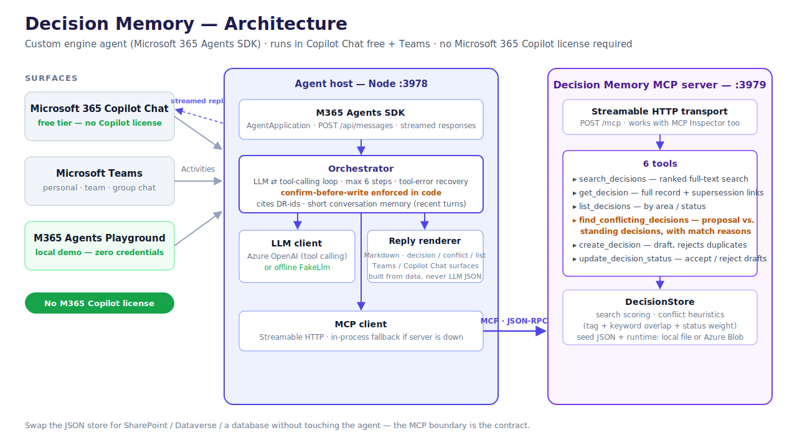
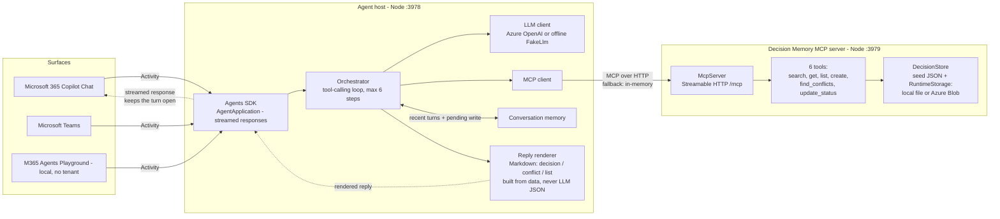

# Architecture

Decision Memory is a **custom engine agent** for Microsoft 365: it brings its
own model and orchestration, so it runs in Microsoft 365 Copilot Chat (free
tier) and Teams **without a Microsoft 365 Copilot license**.

## Turn lifecycle

1. A user message arrives at `/api/messages` (Agents SDK `AgentApplication`).
   The handler immediately opens a **streaming response** with an informative
   update ("Searching the decision records…"). This keeps the turn open on
   Microsoft 365 Copilot Chat while the multi-step loop runs — otherwise
   Copilot's synchronous reply window can expire and drop the late answer. On
   non-streaming channels (Playground / `ExpectReplies`) it degrades to a
   single final message.
2. The orchestrator sends the system prompt, the last few conversation turns
   (kept in per-conversation memory, the latest 6 user/assistant exchanges),
   and the MCP tool catalog (fetched via `listTools` and mapped to function
   definitions) to the LLM.
3. The LLM plans tool calls — e.g. a proposal triggers
   `find_conflicting_decisions`, then `get_decision` to read the standing
   decision's rationale — and the orchestrator dispatches each call through the
   MCP client, feeding results back until the model answers (max 6 iterations).
4. Replies are built **deterministically from tool results**, never from
   LLM-generated JSON. The renderer routes by channel: card-capable surfaces
   (Agents Playground, Web Chat / Direct Line) get Adaptive Cards
   (decision / conflict / list), while Teams and M365 Copilot Chat — which
   flatten card attachments into raw text — get the same content as Markdown
   (`src/agent/markdown.ts` mirrors each card builder). The rendered text and
   any cards are streamed back (`queueTextChunk` / `setAttachments` →
   `endStream`) under the "Generated by AI" label.
5. Write tools (`create_decision`, `update_decision_status`) are intercepted:
   the orchestrator first **dry-runs** the write (the tools' `dryRun` flag) so
   invalid writes are refused immediately instead of asking the user to
   confirm something doomed. Valid writes are stored as pending in
   conversation state; only an explicit, unqualified "yes" executes them. A
   qualified confirmation ("yes, but change…") never writes, and any other
   message discards the pending write.

## Decision lifecycle

`proposed` → `accepted` or `deprecated` via `update_decision_status`
(runtime-created records only). Accepting a record that names a `supersedes`
target marks that target — seed records included — as `superseded` with a
`supersededBy` back-link; a draft or rejected draft never affects the target.
Superseded records are down-weighted in conflict scoring, and the agent
follows `supersededBy` chains to present the decision currently in force.

## Persistence

Seed and runtime records are selected at startup:

- **Default (zero credentials):** a gitignored local file,
    `data/decisions.runtime.json`, plus seed from committed
    `data/decisions.seed.json`.
- **Azure Blob Storage:** set `AZURE_STORAGE_CONNECTION_STRING` (or
    `SECRET_AZURE_STORAGE_CONNECTION_STRING`) and the app loads seed records from
    blob `decisions.seed.json` while persisting runtime records to
    `decisions.runtime.json` in container `decision-memory` (override with
    `AZURE_STORAGE_CONTAINER` / `AZURE_STORAGE_SEED_BLOB` /
    `AZURE_STORAGE_BLOB`). The container is created on first runtime write.

Every mutation is written through and awaited before the tool returns, so a
successful tool result always means the data is durable. Runtime persistence
still stores only runtime records plus seed overrides (e.g., supersession
state), which are re-applied at load time.
## Reliability & safety design

| Risk | Mitigation |
|---|---|
| Hallucinated decisions | System prompt forbids unsourced claims; every answer cites DR-ids; cards are rendered from store data only |
| Runaway tool loops | Hard cap of 6 LLM iterations per turn |
| Tool failures | Per-call try/catch returns the error to the model as tool output so it can recover and explain |
| Dropped / late Copilot replies | Long multi-step turns stream an early informative update, keeping Copilot's synchronous reply window open so the final answer isn't discarded |
| Unintended writes | Two-turn confirm flow enforced in code (not just in the prompt); qualified confirmations ("yes, but…") never execute; writes are dry-run validated before the confirm prompt; duplicate titles rejected by the store |
| Credential leakage | No secrets in the repo; secret env vars live in gitignored `env/.env.*.user` files |
| Stale answers | Superseded records carry `supersededBy` links and are down-weighted in conflict scoring |

## Why MCP (and not direct function calls)?

The decision store is exposed exclusively through the Model Context Protocol:

- The same six tools serve the agent, unit tests (via `InMemoryTransport`),
  and any external MCP client — point MCP Inspector or Claude Desktop at
  `http://localhost:3979/mcp` and you get the identical capability surface.
- The agent degrades gracefully: if the HTTP MCP server is down, it falls back
  to in-process wiring of the same `McpServer` instance.
