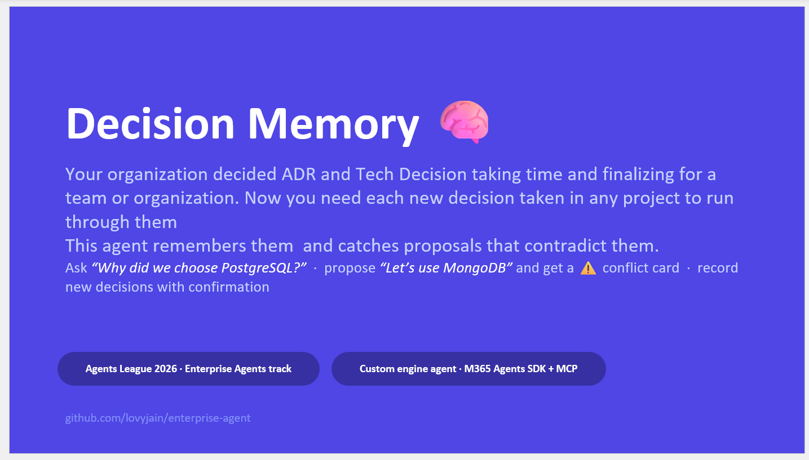
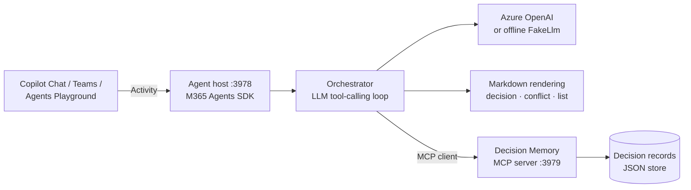

# Decision Memory 🧠

**An institutional-memory agent for Microsoft 365 — it remembers *why* your organization decided things, and catches new proposals that contradict standing decisions.**

> Built as a **custom engine agent** with the Microsoft 365 Agents SDK.
> Because it brings its own model, it runs in **Microsoft 365 Copilot Chat (free)** and **Teams** — **no Microsoft 365 Copilot license required**.



## Version history

Version|Date|Author|Comments
-------|----|----|--------
1.0|June 2, 2026|Lovy Jain|Initial release

## The problem

Organizations make thousands of decisions, but the *reasoning* evaporates: people leave, chats scroll away, and new teams re-litigate settled questions — or worse, quietly violate them. Six months later someone ships a MongoDB cluster, unaware the company standardized on PostgreSQL after two painful incidents.

## What it does

| Ask it... | It will... |
|---|---|
| *"Why did we choose PostgreSQL?"* | Search the decision store, read the record, and answer with the original context and rationale — always citing the decision id |
| *"We're proposing to use MongoDB for the orders service"* | Proactively run conflict detection, find the standing decision it contradicts, and show a ⚠️ conflict warning with the recorded reasoning |
| *"What's our current standard for partner APIs?"* | Follow supersession chains (REST → superseded by → GraphQL federation) and present the decision currently in force |
| *"Record a decision: ..."* | Draft a new decision record and **require explicit confirmation before anything is written** |
| *"Accept DR-015"* | Promote a draft to `accepted` (or reject it as `deprecated`) — again with explicit confirmation |

## Demo

Watch the agent in action:
[](https://www.youtube.com/watch?v=ZbUZAjQ24cM&t=303s)

## Architecture




Full details, turn lifecycle, and the reliability/safety design: [docs/architecture.md](docs/architecture.md).

- ✅ **MCP integration** — the decision store is exposed *only* through a real [Model Context Protocol](https://modelcontextprotocol.io) server (Streamable HTTP, 6 tools). Point MCP Inspector at `http://localhost:3979/mcp` and use the same tools the agent uses.


## Quickstart — zero credentials needed

The repo runs fully offline: with no Azure OpenAI variables set, a deterministic `FakeLlm` drives the same multi-step tool loop, so you can try everything without any cloud account.

```bash
npm install
npm test          # 64 unit tests: store, conflict heuristics, MCP round-trip, cards, orchestrator
npm run smoke     # offline end-to-end: proposal → conflict detection → DR-003 conflict

# Run it interactively (3 terminals):
npm run dev:mcp       # 1. Decision Memory MCP server on :3979
npm run dev           # 2. agent host on :3978
npm run playground    # 3. Microsoft 365 Agents Playground — opens a browser chat UI
```

The [Agents Playground](https://learn.microsoft.com/en-us/microsoftteams/platform/toolkit/debug-your-agents-playground) emulates Teams/Copilot locally — rich replies render fully — with **no Microsoft 365 tenant, no Azure bot registration, no tunnels**.

### With a real model (Azure OpenAI)

Out of the box the agent runs on the offline `FakeLlm`. The moment both
`AZURE_OPENAI_ENDPOINT` and `SECRET_AZURE_OPENAI_API_KEY` are present (and
`USE_FAKE_LLM` is not `true`), it switches to Azure OpenAI automatically — no
code change:

```bash
export AZURE_OPENAI_ENDPOINT=https://<resource>.openai.azure.com
export SECRET_AZURE_OPENAI_API_KEY=<key>
export AZURE_OPENAI_DEPLOYMENT=gpt-4o-mini      # any tool-calling chat deployment (default: gpt-4o-mini)
export AZURE_OPENAI_API_VERSION=2024-10-21      # optional (default: 2024-10-21)
npm run dev:mcp & npm run dev
```

| Variable | Required | Default | Notes |
|---|---|---|---|
| `AZURE_OPENAI_ENDPOINT` | yes | — | e.g. `https://my-resource.openai.azure.com` |
| `SECRET_AZURE_OPENAI_API_KEY` | yes | — | resource key (also accepts `AZURE_OPENAI_API_KEY`) |
| `AZURE_OPENAI_DEPLOYMENT` | no | `gpt-4o-mini` | must be a **tool-calling** chat deployment |
| `AZURE_OPENAI_API_VERSION` | no | `2024-10-21` | |
| `USE_FAKE_LLM` | no | `false` | set to `true` to force the offline model even when a key is present |

Don't have a resource yet? Provision one and a deployment with the Azure CLI:

```bash
az cognitiveservices account create -n <resource> -g <rg> -l eastus --kind OpenAI --sku S0
az cognitiveservices account deployment create -n <resource> -g <rg> \
  --deployment-name gpt-4o-mini --model-name gpt-4o-mini --model-format OpenAI \
  --sku-name Standard --sku-capacity 1
az cognitiveservices account keys list -n <resource> -g <rg> --query key1 -o tsv   # -> SECRET_AZURE_OPENAI_API_KEY
```

For sideloaded Teams / Copilot runs, put the same values in `env/.env.local`
(keep the key in the gitignored `env/.env.local.user`) instead of `export`.

### In Microsoft 365 Copilot Chat and Teams (sideload)

Prerequisites: a Microsoft 365 tenant with custom app upload enabled (a free [developer tenant](https://learn.microsoft.com/en-us/microsoftteams/platform/concepts/build-and-test/prepare-your-o365-tenant) works) — **no Microsoft 365 Copilot license needed**.

1. Install the [Microsoft 365 Agents Toolkit](https://learn.microsoft.com/en-us/microsoft-365/developer/agents-toolkit) extension (VS Code) or CLI (`npm i -g @microsoft/m365agentstoolkit-cli`).
2. Sign in to your tenant, then run the **Local** debug profile (or `atk provision --env local`). The toolkit registers the bot, builds `appPackage/` (manifest v1.22 with `copilotAgents.customEngineAgents`), sideloads it, and extends it to Microsoft 365.
3. Open **Copilot Chat → Agents → Decision Memory**, or chat with it in Teams.

### Troubleshooting Teams / Copilot Chat

| Symptom | Cause & fix |
|---|---|
| Agent replies in the playground but not in Teams/Copilot | The agent is running without bot credentials. Start it with `npm run dev:teamsfx` (loads `.localConfigs` written by `atk deploy --env local`), not `npm run dev`. The startup log warns when credentials are missing. |
| "Something went wrong" / no response after it used to work | Your dev tunnel URL changed. Update `BOT_ENDPOINT` in `env/.env.local` and re-run `atk provision --env local`. |
| Agent doesn't appear in Copilot Chat's agent list | The `teamsApp/extendToM365` step needs a few minutes to propagate; also confirm your tenant allows custom app upload. Re-run `atk provision --env local` if you changed the manifest. |
| Messages in group chats include "@Decision Memory" | Handled — the app strips recipient mentions before the orchestrator sees the text. |
| Long silence before answers with a real model | Handled — the agent sends a typing indicator while the tool loop runs. |
| Welcome message appears twice (or not at all) | Handled — the welcome only fires when a user (not the bot itself) is added to the conversation. |

Replies also carry the **"Generated by AI"** label entity, which Teams and Copilot Chat display natively.

## The MCP server

| Tool | Purpose |
|---|---|
| `search_decisions` | Ranked full-text search over decision records |
| `get_decision` | Full record by id, including supersession links |
| `list_decisions` | Filter by area and/or status |
| `find_conflicting_decisions` | Heuristic conflict candidates for a proposal, with match reasons |
| `create_decision` | Record a new draft (status `proposed`); rejects duplicates; can name a decision it `supersedes` |
| `update_decision_status` | Promote a draft to `accepted` (which marks any superseded decision and links it back) or reject it as `deprecated` |

Both write tools support a `dryRun` flag; the agent uses it to validate every write *before* asking the user to confirm, so you're never asked to approve something the store will reject.

Conflict detection is two-stage by design: a deterministic heuristic (tag overlap + keyword overlap + status weight) guarantees recall and explainability, then the LLM judges which candidates are genuine contradictions — that's the multi-step reasoning story.

### Persistence: local file or Azure Storage account

By default (zero credentials) the store is file-based: seed records load from the
committed `data/decisions.seed.json` and runtime-created records persist to a
gitignored local JSON file. To make decisions durable across restarts and hosts,
point the app at an **Azure Storage account** — then both the agent and the MCP
server read the seed from blob and persist new records to blob.

With a connection string set, the app uses **two blobs** in one container:

| Blob (env var / default) | Purpose | Created by |
|---|---|---|
| seed — `AZURE_STORAGE_SEED_BLOB` / `decisions.seed.json` | starting records, read once at startup | **you, before first run** |
| runtime — `AZURE_STORAGE_BLOB` / `decisions.runtime.json` | records added via `create_decision` | the app, on first write |

> ⚠️ The **seed blob must exist before you start** with a connection string:
> startup loads it first and fails with *"Seed blob … was not found"* if it's
> missing. The container and the runtime blob, by contrast, are created
> automatically.

**1 — Create the account + container and upload the seed (Azure CLI):**

```bash
# storage account + a container to hold the decision blobs
az storage account create -n <account> -g <rg> -l eastus --sku Standard_LRS
CONN=$(az storage account show-connection-string -n <account> -g <rg> --query connectionString -o tsv)
az storage container create -n decision-memory --connection-string "$CONN"

# upload the seed so the agent has something to read on startup
# (edit data/decisions.seed.json first if you want your own records, or upload `[]` to start empty)
az storage blob upload --connection-string "$CONN" \
  -c decision-memory -f data/decisions.seed.json -n decisions.seed.json
```

**2 — Point the app (and the MCP server) at it:**

```bash
export AZURE_STORAGE_CONNECTION_STRING="$CONN"
# optional overrides (defaults shown):
export AZURE_STORAGE_CONTAINER=decision-memory
export AZURE_STORAGE_SEED_BLOB=decisions.seed.json
export AZURE_STORAGE_BLOB=decisions.runtime.json

npm run dev:mcp & npm run dev
```

On startup the log confirms the backend, e.g.
`Decision seed source: Azure Blob Storage (container "decision-memory", blob "decisions.seed.json")`.
From then on, every record created through the MCP `create_decision` tool (from
the agent or directly via MCP Inspector at `http://localhost:3979/mcp`) is
written to the runtime blob. Writes are awaited before any tool returns, so a
successful "Recorded DR-015" always means the record is durable in blob.

**No account? Emulate locally** with Azurite: `npx azurite-blob
--skipApiVersionCheck`, then use `AZURE_STORAGE_CONNECTION_STRING=UseDevelopmentStorage=true`
(still upload the seed blob first with the same `--connection-string UseDevelopmentStorage=true`).


## Project layout

```
src/agent/      orchestrator (tool loop), LLM clients, Markdown + Adaptive Card renderers, Agents SDK host
src/mcp/        MCP tools, Streamable HTTP server, client (HTTP + in-memory fallback)
src/store/      decision record schema, search scoring, conflict heuristics
data/           seed decision records (fictional "Contoso Logistics")
appPackage/     Teams/M365 manifest (v1.22, custom engine agent) + icons
tests/ scripts/ 64 unit tests + offline e2e smoke — all run with zero credentials (CI does too)
```

## Limitations

- The decision store is a JSON file by design, to keep the sample self-contained. In actual production this JSON data would be retrieved from a wiki or any other data source. The MCP in this sample can also use an Azure Storage account.
- The offline `FakeLlm` follows fixed rules; nuanced conflict judgment needs the real model.
- Seed data is fictional.

## License

MIT — see [LICENSE](LICENSE).


