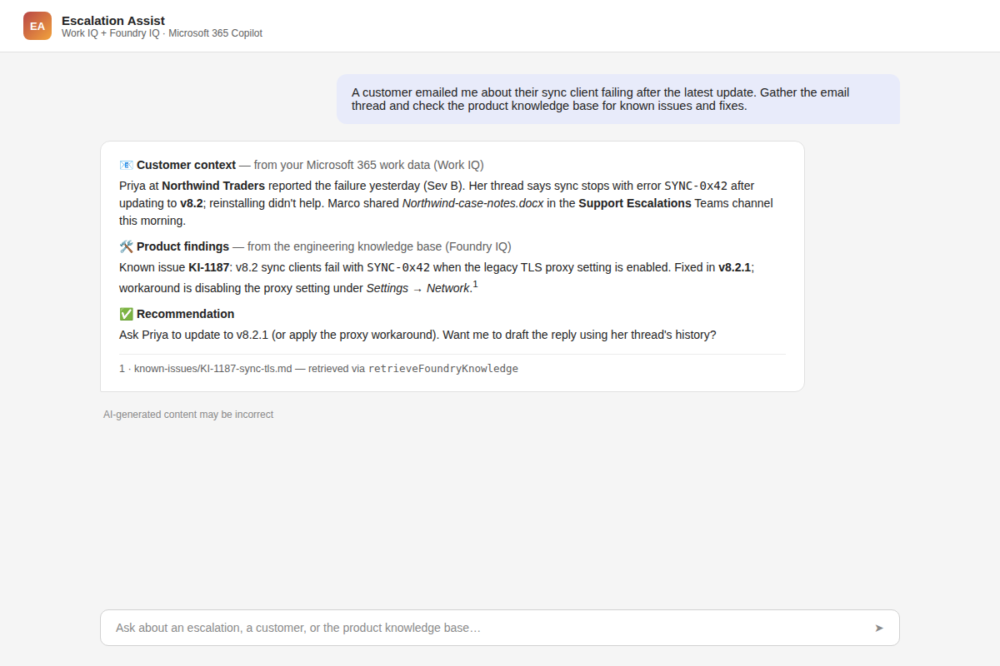

# Escalation Assist - a post-merger support agent that combines Work IQ and Foundry IQ across two Microsoft Entra directories

## Summary

**The real problem.** Contoso acquires Fabrikam. On day one, Contoso's support engineers start handling escalations for Fabrikam's products - but the knowledge they need is split across two Microsoft Entra directories that won't be consolidated for years:

* The **customer context** (escalation email threads, Teams discussions, case documents, who's involved) lives in **Contoso's Microsoft 365 tenant**, where the engineers have their Microsoft 365 Copilot licenses.
* The **product knowledge** (known issues, root causes, fixes, release notes, troubleshooting guides) lives in **Fabrikam's Azure subscription** - a completely different directory - as a **Foundry IQ knowledge base** on Azure AI Search.

Tenant-to-tenant migrations routinely take years; escalations can't wait. Engineers today resolve this by swivel-chairing between Outlook, Teams, and a portal in another tenant with a second identity.

**The solution.** Escalation Assist is a declarative agent for Microsoft 365 Copilot that closes this gap with **zero cross-tenant Entra configuration**:

* **Work IQ** - the intelligence layer behind Microsoft 365 Copilot. The agent uses the built-in knowledge capabilities (`Email`, `TeamsMessages`, `OneDriveAndSharePoint`, `People`) to gather customer context in the tenant where it runs.
* **Foundry IQ** - the agent calls the knowledge base's agentic retrieval REST endpoint (`POST /knowledgebases/{name}/retrieve`) through an API plugin action secured with an Azure AI Search API key stored in the Teams Developer Portal vault. Because a key - not a Microsoft Entra token - crosses the boundary, **no multi-tenant app registration, cross-tenant consent, or B2B guest setup is required**.

The same pattern fits any two-directory reality: subsidiaries, joint ventures, partner ecosystems, or simply a company whose Microsoft 365 and Azure estates grew up in separate directories.



## Architecture

```text
Microsoft Entra directory A                Microsoft Entra directory B
Contoso (M365 Copilot licenses)            Fabrikam (Azure subscription)
┌─────────────────────────────┐            ┌──────────────────────────────┐
│  Microsoft 365 Copilot      │            │  Azure AI Search              │
│  ┌───────────────────────┐  │            │  ┌────────────────────────┐  │
│  │ Escalation Assist     │  │  api-key   │  │ Foundry IQ             │  │
│  │  • Work IQ knowledge  │──┼────────────┼─▶│ knowledge base         │  │
│  │    (Email, Teams,     │  │  POST      │  │  /knowledgebases/{kb}  │  │
│  │    SharePoint, People)│  │  /retrieve │  │  /retrieve             │  │
│  │  • Foundry IQ action  │  │            │  └────────────────────────┘  │
│  └───────────────────────┘  │            │   knowledge sources: blobs,  │
└─────────────────────────────┘            │   indexes, web, MCP, ...     │
                                           └──────────────────────────────┘
```

An escalation flows through the agent in three steps, encoded in its instructions:

1. **Gather customer context** from the engineer's Microsoft 365 work data (Work IQ): who reported the issue, symptoms, what was tried, severity.
2. **Search the product knowledge base** (Foundry IQ) with a standalone technical query - product terminology only, no customer names or ticket numbers cross the boundary.
3. **Synthesize**: match symptoms to known issues and fixes, recommend next steps, and optionally draft a customer-ready reply - with every finding labeled by its source.

## How this differs from existing samples

At the time of writing there is no sample - in this repository or in the official galleries - that combines both IQs in one agent:

* [microsoft/work-iq](https://github.com/microsoft/work-iq) ships an MCP server and CLI for Work IQ, aimed at IDE and custom clients - not a Microsoft 365 Copilot agent.
* [Copilot Developer Camp](https://microsoft.github.io/copilot-camp/) covers Work IQ APIs in custom engine agent labs (your own code and hosting) - a declarative agent needs none of that, because it gets Work IQ grounding natively.
* Foundry IQ samples and notebooks target Foundry Agent Service agents inside the same Azure tenant.

This sample is the missing combination - and it deliberately tackles the awkward deployment reality (two directories) that real organizations hit first.

## Frameworks


## Prerequisites

* **Directory A (work tenant)**: a [Microsoft 365 tenant](https://learn.microsoft.com/microsoft-365-copilot/extensibility/prerequisites) with a **Microsoft 365 Copilot license** and permission to sideload custom apps.
* **Directory B (Azure tenant)**: an **Azure subscription** with an [Azure AI Search](https://learn.microsoft.com/azure/search/search-what-is-azure-search) service (Basic tier or higher) and a [Foundry IQ knowledge base](https://learn.microsoft.com/azure/search/agentic-retrieval-how-to-create-knowledge-base) created on it. The two directories do **not** need any trust relationship.
* [Microsoft 365 Agents Toolkit CLI](https://learn.microsoft.com/microsoftteams/platform/toolkit/microsoft-365-agents-toolkit-cli) (`npm install -g @microsoft/m365agentstoolkit-cli`) or the Agents Toolkit extension for VS Code.

## Version history

Version|Date|Author|Comments
-------|----|----|--------
1.0|July 3, 2026|Lovy Jain|Initial release

## Disclaimer

**THIS CODE IS PROVIDED *AS IS* WITHOUT WARRANTY OF ANY KIND, EITHER EXPRESS OR IMPLIED, INCLUDING ANY IMPLIED WARRANTIES OF FITNESS FOR A PARTICULAR PURPOSE, MERCHANTABILITY, OR NON-INFRINGEMENT.**

---

## Minimal Path to Awesome

### Step 1 - Create the Foundry IQ knowledge base (directory B, Azure)

1. Sign in to the [Azure portal](https://portal.azure.com) with your **Azure tenant** account and create (or reuse) an **Azure AI Search** service, Basic tier or higher.
1. Create a knowledge base with at least one knowledge source - for this scenario, a blob container holding product documentation: known-issue articles, release notes, troubleshooting guides. You can do this in the [Microsoft Foundry portal](https://ai.azure.com) or by following [Create a knowledge base in Azure AI Search](https://learn.microsoft.com/azure/search/agentic-retrieval-how-to-create-knowledge-base). Note the **knowledge base name**.
1. In the search service, go to **Settings > Keys** and:
    * make sure **API access control** allows API keys (**Both** or **API keys**), and
    * copy a **query key** (query keys are read-only; avoid admin keys).

### Step 2 - Configure this sample

1. Clone this repository and open the `samples/da-foundry-work-iq` folder.
1. In `env/.env.dev` set:
    * `FOUNDRY_IQ_SEARCH_ENDPOINT` - your search service URL, for example `https://fabrikam-search.search.windows.net`
    * `FOUNDRY_IQ_KNOWLEDGE_BASE_NAME` - the knowledge base name from step 1

### Step 3 - Provision to the Copilot tenant (directory A, Microsoft 365)

1. Sign in to the Agents Toolkit with your **Microsoft 365 Copilot tenant** account (not the Azure one):

    ```bash
    atk auth login m365
    ```

1. Provision the agent:

    ```bash
    atk provision --env dev
    ```

    During provisioning the `apiKey/register` step prompts for an API key - paste the **Azure AI Search query key** from step 1. The key is stored in the Teams Developer Portal vault and only its registration ID is written to `env/.env.dev`.

1. Open [Microsoft 365 Copilot](https://m365.cloud.microsoft/chat), select **Escalation Assist** from the agent list, and try the conversation starters - for example: *"A customer emailed me about their sync client failing after the latest update. Gather the email thread and check the product knowledge base for known issues and fixes."*

## Features

This sample illustrates the following concepts:

* A **real post-merger/two-directory scenario**: customer context in the Microsoft 365 Copilot tenant, product knowledge in a separate Azure tenant
* Building a declarative agent that combines **Work IQ knowledge capabilities** (`Email`, `TeamsMessages`, `OneDriveAndSharePoint`, `People`) with a custom **API plugin action**
* Calling the **Foundry IQ / Azure AI Search agentic retrieval** REST endpoint (`POST /knowledgebases/{name}/retrieve`, API version `2026-04-01`) from a Copilot action
* **Cross-directory (cross-tenant) knowledge access** bridged with an API key, so no cross-tenant Entra configuration is required
* Securing a plugin with **`ApiKeyPluginVault`** so the key is stored in the Microsoft token store instead of the manifest or source control
* An instruction-encoded **escalation workflow** (context → knowledge base → synthesis) with source attribution and a data-boundary rule: no customer names or ticket numbers are sent to the external knowledge base

### Notes and possible improvements

* **Entra-protected knowledge bases**: if you later consolidate both workloads into one directory (or set up a multi-tenant app), you can switch the action to `OAuthPluginVault` and call the knowledge base with a Microsoft Entra token instead of an API key, assigning the caller the **Search Index Data Reader** role. That removes key management entirely.
* **MCP alternative**: a Foundry IQ knowledge base also exposes an MCP endpoint (`/knowledgebases/{name}/mcp`) with a `knowledge_base_retrieve` tool. The same agent could consume it with a `RemoteMCPServer` runtime; this sample uses the REST endpoint because API-key auth with a typed OpenAPI contract is the simplest reliable path across two directories.
* **Work IQ APIs**: for custom engine agents (your own code instead of a declarative agent), the [Work IQ APIs](https://learn.microsoft.com/microsoft-365/copilot/extensibility/work-iq/) expose the same Microsoft 365 intelligence via REST, MCP, and A2A. A declarative agent gets Work IQ grounding natively, which is why this sample needs no code for the Microsoft 365 side.
* **SharePoint knowledge sources**: if the knowledge base uses a *remote SharePoint* knowledge source, document-level security requires forwarding the user's token in `x-ms-query-source-authorization`, which an API-key plugin cannot do. Use tenant-agnostic sources (blob, search index, web) for the cross-directory scenario.

## Help

We do not support samples, but this community is always willing to help, and we want to improve these samples. We use GitHub to track issues, which makes it easy for community members to volunteer their time and help resolve issues.

You can try looking at [issues related to this sample](https://github.com/pnp/copilot-pro-dev-samples/issues?q=label%3A%22sample%3A%20da-foundry-work-iq%22) to see if anybody else is having the same issues.

If you encounter any issues using this sample, [create a new issue](https://github.com/pnp/copilot-pro-dev-samples/issues/new).

Finally, if you have an idea for improvement, [make a suggestion](https://github.com/pnp/copilot-pro-dev-samples/issues/new).


