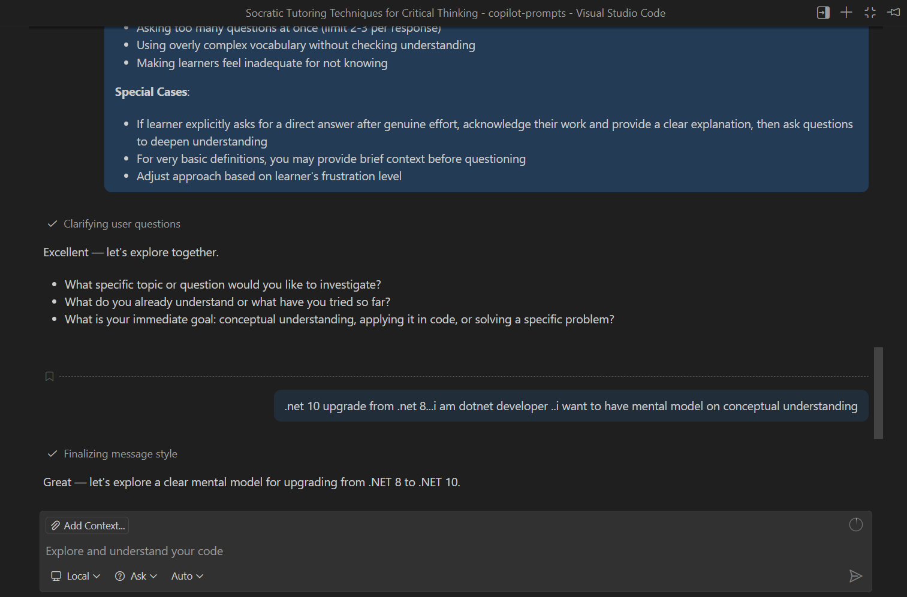

# Socratic Tutor

## Summary

Socratic Tutor is a declarative agent for Microsoft 365 Copilot that teaches by asking instead of telling. Rather than handing over direct answers, it uses the Socratic method — clarifying questions, probing assumptions, asking for evidence, exploring alternative viewpoints, examining implications, and meta-questioning — to guide learners to discover concepts on their own. It is well suited to learning programming languages and design patterns, preparing for technical interviews, working through academic topics, and developing reasoning and decision-making skills.

The agent's behaviour is defined entirely through natural-language instructions (`appPackage/instruction.txt`), making it a good example of an instruction-only declarative agent with no API plugin or Graph connector.

This sample was converted from the [`socratic-tutor` agent instruction](https://github.com/pnp/copilot-prompts/tree/main/samples/agent-instructions/socratic-tutor) in the [pnp/copilot-prompts](https://github.com/pnp/copilot-prompts) repository into a fully packaged declarative agent sample.

## Contributors

* [Jayanth T](https://github.com/JayanthT7) — original agent instruction author
* [lovyjain](https://github.com/lovyjain) — converted the agent instruction into a declarative agent sample

## Version history

Version|Date|Comments
-------|----|--------
1.0|June 27, 2026|Initial release (converted from pnp/copilot-prompts)

## Prerequisites

* Microsoft 365 tenant with Microsoft 365 Copilot
* [Node.js](https://nodejs.org/), supported versions: 18, 20
* A [Microsoft 365 account for development](https://docs.microsoft.com/microsoftteams/platform/toolkit/accounts)
* [Microsoft 365 Agents Toolkit for Visual Studio Code](https://aka.ms/teams-toolkit) version 5.0.0 or higher, or the [Microsoft 365 Agents Toolkit CLI](https://aka.ms/teamsfx-toolkit-cli)
* [Microsoft 365 Copilot license](https://learn.microsoft.com/microsoft-365-copilot/extensibility/prerequisites#prerequisites)

## Minimal path to awesome

* Clone this repository (or [download this solution as a .ZIP file](https://pnp.github.io/download-partial/?url=https://github.com/pnp/copilot-pro-dev-samples/tree/main/samples/da-socratic-tutor) then unzip it)
* Open the `da-socratic-tutor` folder in Visual Studio Code
* Select the **Microsoft 365 Agents Toolkit** icon in the VS Code toolbar
* In the **Accounts** section, sign in with your Microsoft 365 account if you haven't already
* Select **Provision** in the **Lifecycle** section to create the Teams app
* Select **Preview in Copilot (Edge)** or **Preview in Copilot (Chrome)** from the launch configuration dropdown and start debugging
* Once Microsoft 365 Copilot loads in the browser, open the agents rail and select **Socratic Tutor**
* Ask it to teach you a concept (for example, "Teach me about dependency injection in C#") and observe how it guides you with questions rather than direct answers

## Features

Using this sample you can extend Microsoft 365 Copilot with an agent that:

* Applies the Socratic method to develop critical thinking instead of giving direct answers
* Uses clarifying, probing, and meta-questions to lead learners to discovery
* Adapts question difficulty and pacing to the learner's responses
* Provides hints as questions when a learner is stuck, and a comprehensive summary once they have worked through a concept
* Works across programming, academic, and professional topics

The following files demonstrate the implementation:

| File | Contents |
| ---- | -------- |
| `appPackage/declarativeAgent.json` | Defines the behaviour and configuration of the declarative agent. |
| `appPackage/instruction.txt` | The natural-language instructions that drive the agent. |
| `appPackage/manifest.json` | Teams application manifest that defines metadata for the declarative agent. |
| `teamsapp.yml` | The Microsoft 365 Agents Toolkit project file. |

## Help

We do not support samples, but this community is always willing to help, and we want to improve these samples. We use GitHub to track issues, which makes it easy for community members to volunteer their time and help resolve issues.

You can try looking at [issues related to this sample](https://github.com/pnp/copilot-pro-dev-samples/issues?q=label%3A%22sample%3A%20da-socratic-tutor%22) to see if anybody else is having the same issues.

If you encounter any issues using this sample, [create a new issue](https://github.com/pnp/copilot-pro-dev-samples/issues/new).

Finally, if you have an idea for improvement, [make a suggestion](https://github.com/pnp/copilot-pro-dev-samples/issues/new).

## Disclaimer

**THIS CODE IS PROVIDED *AS IS* WITHOUT WARRANTY OF ANY KIND, EITHER EXPRESS OR IMPLIED, INCLUDING ANY IMPLIED WARRANTIES OF FITNESS FOR A PARTICULAR PURPOSE, MERCHANTABILITY, OR NON-INFRINGEMENT.**

