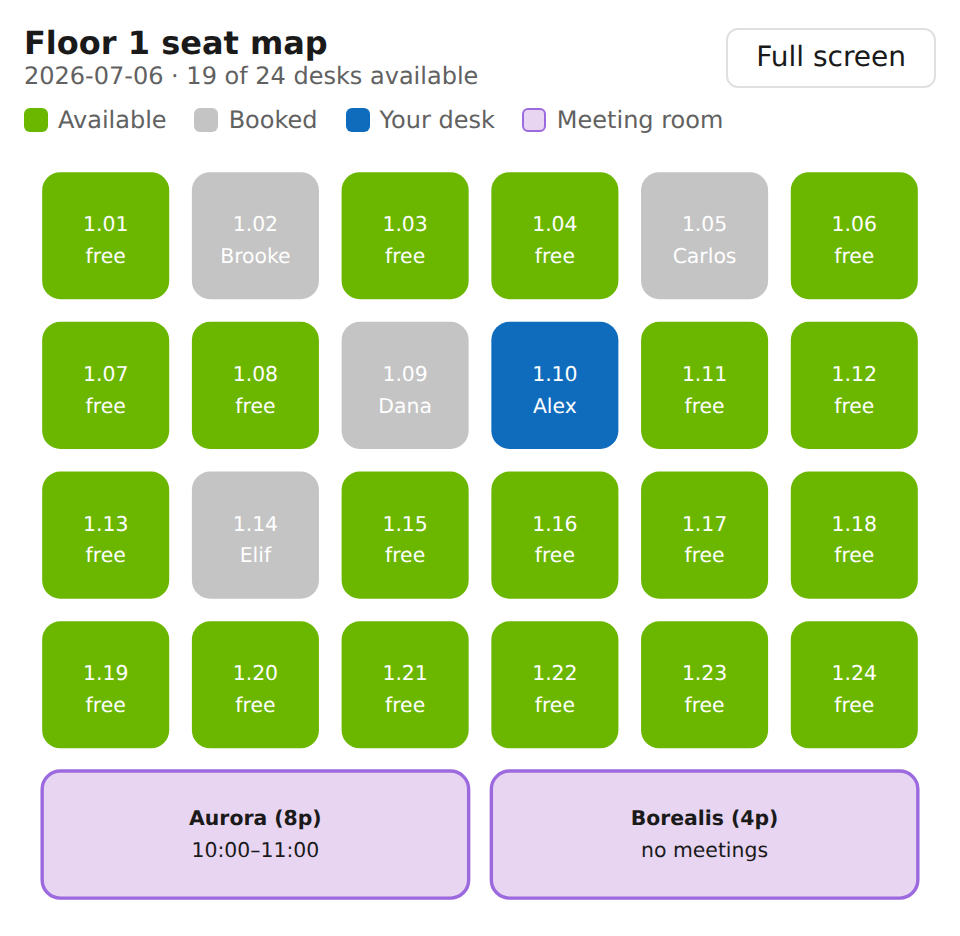

# Booking desks and meeting rooms with interactive MCP Apps widgets

## Summary

Workplace Concierge is a declarative agent for Microsoft 365 Copilot that helps employees plan their days in the office: find and book a desk, check meeting room availability, see who is coming in, and manage bookings.

What makes this sample different is *how* the agent answers. Its action is a remote MCP (Model Context Protocol) server that ships **MCP Apps interactive UI widgets**: instead of describing desk availability in text, Copilot renders a clickable office seat map inline in the chat. Users book a desk by selecting it on the map, and cancel bookings from an interactive list — the widgets call MCP tools directly from the UI and hand control back to the agent with follow-up messages.



The sample demonstrates:

* A TypeScript MCP server (Streamable HTTP) that registers UI widgets as MCP resources (`ui://widget/...`, `text/html+skybridge`) and links them to tools with the `openai/outputTemplate` metadata field
* Widgets that use the host bridge (`window.openai`) to read tool output, call tools (`callTool`), send follow-up messages to the agent (`sendFollowUpMessage`), switch to full screen (`requestDisplayMode`), and adapt to the host theme — with feature detection so they degrade gracefully
* A declarative agent that connects to the MCP server through the `RemoteMCPServer` runtime in `ai-plugin.json`

## Contributors

* [Lovy Jain](https://github.com/lovyjain)

## Version history

Version|Date|Comments
-------|----|--------
1.0|July 6, 2026|Initial release

## Prerequisites

* Microsoft 365 tenant with Microsoft 365 Copilot, with custom app upload and Copilot access enabled
* [Visual Studio Code](https://code.visualstudio.com/) with the [Microsoft 365 Agents Toolkit](https://learn.microsoft.com/microsoft-365/developer/microsoft-365-agents-toolkit/install-agents-toolkit) extension (version 6.6.1 or later, required for MCP apps)
* [Node.js](https://nodejs.org/) version 18 or later
* A tunneling tool to expose the local MCP server over public HTTPS, for example the [dev tunnels CLI](https://learn.microsoft.com/azure/developer/dev-tunnels/get-started) or ngrok

## Minimal path to awesome

* Clone this repository (or [download this solution as a .ZIP file](https://pnp.github.io/download-partial/?url=https://github.com/pnp/copilot-pro-dev-samples/tree/main/samples/da-workplace-concierge) then unzip it)
* Build and start the MCP server:

```shell
cd mcp-server
npm install
npm run build
npm start
```

The server listens on `http://localhost:3000/mcp`.

* In a second terminal, expose the server over public HTTPS (Copilot can only reach public endpoints):

```shell
devtunnel host -p 3000 --allow-anonymous
```

Copy the tunnel URL, for example `https://<tunnel-id>.devtunnels.ms`.

* Open the sample folder in Visual Studio Code
* Copy `env/.env.dev.sample` to `env/.env.dev` and set `TEAMSFX_ENV=dev`, `APP_NAME_SUFFIX=dev`, and `MCP_SERVER_URL` to your tunnel URL **including the `/mcp` path**, for example `https://<tunnel-id>.devtunnels.ms/mcp`
* Select the **Microsoft 365 Agents Toolkit** icon in the Activity Bar and sign in to your Microsoft 365 account. Confirm that **Custom App Upload Enabled** and **Copilot Access Enabled** are displayed under your account
* In the **Lifecycle** pane, select **Provision**
* Go to [https://m365.cloud.microsoft/chat](https://m365.cloud.microsoft/chat) and select **Workplace Concierge** in the agents list (select **All agents** if you don't see it)
* Try one of the conversation starters, for example *Show me the office map for tomorrow so I can book a desk*. Allow the agent to connect to the MCP server when prompted
* Select an available (green) desk on the map to book it, then watch the widget hand the confirmation back to the agent

> [!NOTE]
> The widget wiring lives in the `mcp_tool_description.tools` array inside `appPackage/ai-plugin.json`: it mirrors the server's `tools/list` response, including each tool's `_meta["openai/outputTemplate"]` that links it to a UI widget. Copilot reads the tool descriptions from the app package (not from the live server), so **if you change the tools on the server you must regenerate this array** — either use the **ATK: Update Action with MCP** CodeLens in `.vscode/mcp.json`, or dump the server's `tools/list` result into it manually. If the tool descriptions are missing or stale, tool calls still work but the widgets won't render. The tools are kept inline (rather than in a separate file referenced via `mcp_tool_description.file`) so that app packaging always includes them.

### Debug locally with F5

The sample also ships a `local` environment (`m365agents.local.yml` + `env/.env.local`) that automates all of the above:

* Copy `env/.env.local.sample` to `env/.env.local` (the Agents Toolkit also creates it on first run; it's gitignored because provisioning writes your tenant's app IDs and tunnel URL into it)
* Open the sample folder in Visual Studio Code and press **F5** (or select **Run and Debug** > **Debug in Copilot (Edge)**)
* The Agents Toolkit checks prerequisites, starts a dev tunnel for port 3000 (writing the tunnel origin to `MCP_TUNNEL_ENDPOINT` in `env/.env.local`; provisioning derives `MCP_SERVER_URL` from it), provisions a **Workplace Concierge local** copy of the agent, installs the server dependencies, and starts the MCP server with `npm run dev` (watch mode)
* A browser opens on Microsoft 365 Copilot with the local agent selected

> [!NOTE]
> The declarative agent itself always runs in Microsoft 365 Copilot in the cloud — the Microsoft 365 Agents Playground doesn't support declarative agents. "Local" means the MCP server runs on your machine behind a dev tunnel, and a separate `local` copy of the agent is sideloaded into your tenant.

### Local widget playground (no tenant needed)

To iterate on the widgets without provisioning anything, the MCP server hosts a small playground:

* Start the server (`npm run dev` or `npm start` in `mcp-server`)
* Open [http://localhost:3000/playground](http://localhost:3000/playground)

The playground loads the widget HTML through a real `resources/read` call, seeds it with a real tool call, and emulates the `window.openai` bridge — so clicking a desk on the map performs a real `book_desk` call against the server, and follow-up messages appear in the host bridge log. Use the pickers to switch widgets and light/dark theme. This page is a development aid only: the route is registered only when `NODE_ENV` is not set to `production`, so it stays out of real deployments. Keep in mind that while a dev tunnel is running, the playground (like the MCP endpoint itself) is reachable from the internet.

### About the sample data and authentication

The server keeps floors, desks, rooms, and bookings in memory and resets on restart. Because the server uses **anonymous authentication — which Microsoft 365 Copilot supports for development purposes only** — a fixed demo user (Alex Chen) stands in for the signed-in user. Before deploying anything like this to production:

* Add [OAuth 2.1 or Microsoft Entra SSO authentication](https://learn.microsoft.com/microsoft-365-copilot/extensibility/api-plugin-authentication) to the MCP server and derive the user's identity from the token
* Keep the CORS configuration in `mcp-server/src/index.ts`: Copilot renders the widgets from a sandboxed origin (`{hash}.widget-renderer.usercontent.microsoft.com`) that must be allowed for widget-initiated tool calls to reach the server

## Features

This sample illustrates the following concepts:

* Extending a declarative agent with an MCP server action using the `RemoteMCPServer` runtime in `ai-plugin.json`
* Serving **MCP Apps UI widgets** from MCP resources: `ui://widget/office-map.html` and `ui://widget/my-bookings.html` registered with the `text/html+skybridge` MIME type and a locked-down `openai/widgetCSP`
* Linking tools to widgets with the `openai/outputTemplate` tool metadata field, and returning `structuredContent` for the widget to render
* Bi-directional widget interactivity: the seat map books desks with `window.openai.callTool` and notifies the agent with `window.openai.sendFollowUpMessage`; the bookings list cancels bookings in place
* Host integration done right: feature detection for every `window.openai` API, light/dark theme support, intrinsic height notifications, and an optional full-screen mode
* Self-contained widget HTML (no external scripts, styles, or fonts) that satisfies the widget sandbox's content security policy
* A stateless Streamable HTTP MCP server in TypeScript with tools defined via the official MCP SDK

## Help

We do not support samples, but this community is always willing to help, and we want to improve these samples. We use GitHub to track issues, which makes it easy for  community members to volunteer their time and help resolve issues.

You can try looking at [issues related to this sample](https://github.com/pnp/copilot-pro-dev-samples/issues?q=label%3A%22sample%3A%20da-workplace-concierge%22) to see if anybody else is having the same issues.

If you encounter any issues using this sample, [create a new issue](https://github.com/pnp/copilot-pro-dev-samples/issues/new).

Finally, if you have an idea for improvement, [make a suggestion](https://github.com/pnp/copilot-pro-dev-samples/issues/new).

## Disclaimer

**THIS CODE IS PROVIDED *AS IS* WITHOUT WARRANTY OF ANY KIND, EITHER EXPRESS OR IMPLIED, INCLUDING ANY IMPLIED WARRANTIES OF FITNESS FOR A PARTICULAR PURPOSE, MERCHANTABILITY, OR NON-INFRINGEMENT.**


